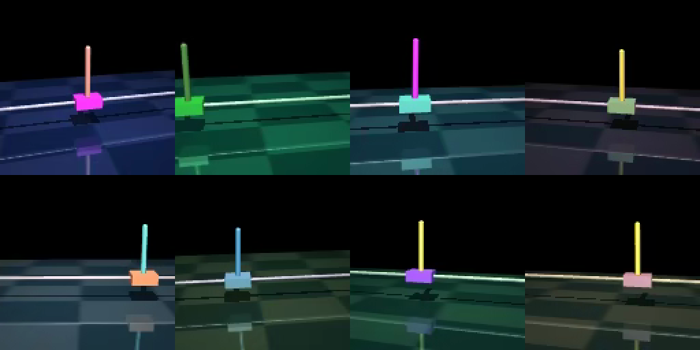
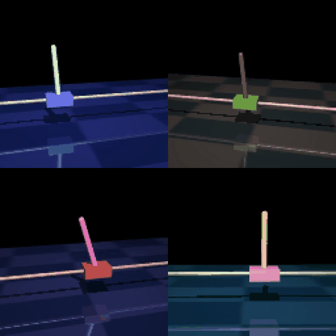

# Scaling Robot Data with Simulation: Breaking Embodied AI's Data Bottleneck

Sep 23, 2026 · Deepak Vij

*Language models learned from the internet. Robots have no internet to learn from. Simulation may be how we build one.*

AI that acts in the physical world — robots that grasp, walk and balance — is often called embodied AI. Its biggest constraint isn't model design or computing power. It's data. Large language models learned from trillions of words people had already written down. Nobody has been recording, at scale, how to grasp a cup, fold a towel or balance a pole on a moving cart.

My argument is simple: **simulation turns robot data from something you collect into something you generate.** Once software generates the data, how much you have, how varied it is and how well it's labeled become choices, not hard limits.

To test this, I built a complete synthetic data pipeline myself, end to end, on a real physics simulator: simulate a robot task, generate training data automatically, teach a model by imitation, then let it improve by practicing in the simulator.

## The robot data gap

Robots have far less data to learn from than language models, and the gap is enormous.

Meta's Llama 3 language model learned from [more than 15 trillion tokens](https://ai.meta.com/blog/meta-llama-3/) (roughly, pieces of words). One of the largest real-world robot datasets, [DROID](https://arxiv.org/abs/2403.12945), has 76,000 recorded demonstrations — about 350 hours of robot activity. Collecting it took 50 people on three continents a full year. Another major effort, [Open X-Embodiment](https://arxiv.org/abs/2310.08864), needed 21 institutions pooling data from 22 different robots.

Five things make robot data scarce:

- **It's physical.** Every example needs a real robot, a real setting and real time. You can't download it from the web.
- **It's slow and costly.** Most examples come from a person remotely controlling the robot (called teleoperation), one attempt at a time.
- **It's tied to one robot.** Data from one robot arm doesn't carry over cleanly to a different arm, gripper or camera.
- **It needs actions, not just video.** Videos of people doing tasks are everywhere. Records of the exact motor commands behind them are rare.
- **It rarely shows failure.** Nobody wants to crash a robot on purpose, so datasets lack the mistakes a robot most needs to learn from.

So robotics can't just copy the language-model approach of gathering more data. The data has to come from somewhere else.

## Simulation as a data engine

A physics simulator is software that imitates the real world. It moves a virtual scene forward in tiny time steps, applying gravity, friction, collisions and motor forces. Record what happens, and you have training data.

Simulated data isn't valuable just because it's cheap. It gives you five advantages real-world collection can't match:

1. **As much as you want.** Simulations run faster than real time, many at once. NVIDIA reported generating [780,000 simulated robot runs in 11 hours](https://nvidianews.nvidia.com/news/nvidia-isaac-gr00t-n1-open-humanoid-robot-foundation-model-simulation-frameworks) — about 6,500 hours' worth of human demonstrations.
2. **Variety by design.** Each run can change weights, friction, lighting, colors, camera angles and starting positions. This is called domain randomization. The model can't memorize one setup, so it has to learn what actually matters.
3. **Perfect measurements.** The simulator knows the exact position and speed of everything — things that are hard or impossible to measure on a real robot.
4. **Safe failure.** Simulated robots can fall and crash thousands of times at no cost.
5. **A place to practice.** A model can try things in the simulator, see what happens and improve, creating new data from its own mistakes.

The same NVIDIA announcement reported that adding simulated data to real data made their humanoid robot model perform 40% better than real data alone. That's the key pattern: simulated data doesn't have to replace real data. It multiplies it.

## Putting the idea to the test

To see these advantages for myself, I built a complete, working pipeline from scratch, on the same kind of physics simulator robotics researchers use. It produces all of its own training data — no hand-collected data at all. Every tool is free and open source: the MuJoCo physics simulator, Hugging Face's LeRobot data format and PyTorch.

The task: keep a pole balanced on a moving cart, using **only camera images**. When it runs, the model is never told the pole's angle; it has to see it. Balancing a pole is a classic beginner problem in robotics, but doing it from images means the model must learn both to see and to act.

The process had five steps:

```
1. Simulate        MuJoCo runs the cart and pole
2. Generate data   an expert balances the pole in many varied worlds; everything is recorded
3. Imitate         a model learns by copying the expert
4. Evaluate        test the model in worlds it has never seen
5. Practice        the model improves by trial and error in the simulator
```

### Where the examples come from

A simulator only works out consequences: push the cart, and MuJoCo shows what happens next. It never decides how hard to push. Left alone, the pole just falls.

So each example needs an **expert**: a program that chooses the right push at every moment while the simulator records the result. My expert used a standard formula from control theory that calculates the best balancing rule from the simulator's physics. It balanced the pole every time.

The expert has an unfair advantage: it reads the exact physics, which no real robot can. The model it trains has to learn the same skill from camera images alone.

**Isn't that just human labeling?** It plays the same role: the expert's actions are the "right answers" the model learns to copy. But it works differently:

- **It demonstrates instead of annotating.** A human labeler marks up data after it's collected. The expert acts inside the simulation, creating the data and its answers at the same time.
- **Its human equivalent is teleoperation** — a person remotely driving the robot while it's recorded. That's how most real robot data is collected, and it's the slow, costly step behind the data gap.
- **It's code.** It never gets tired, costs nothing per example and sees physics no person could see in an image.

Replacing the human with code is what turned weeks of collection into two minutes. The catch: a code expert only exists for tasks we can solve with math. For tasks like folding laundry, teams still start from a few human demonstrations and use simulation to multiply them — the approach behind NVIDIA's results above.



Three results support the argument.

### Result 1: More simulated data made the biggest difference

I trained the same model, the same way, on two amounts of simulated data:

```
Simulated examples     Time to generate    Success in new worlds
 50 runs                    30 sec               35%
200 runs                     2 min               85%
```

Nothing changed except the amount of data — and making four times more took two minutes. In the real world, that would mean weeks of teleoperation. In simulation, it's one setting.

### Result 2: The simulator doubled as a practice ground

Learning by imitation has a weakness: the model only sees situations the expert got into. When it drifts somewhere new, it has no example to follow. In 50 new worlds, the imitation-trained model succeeded 74% of the time.

Then I let it practice with reinforcement learning (RL) — learning by trial and error. It tried the task in 16 simulated worlds at once, got a score for every move, and adjusted toward what worked. After about seven minutes:

```
Approach                              Success in 50 new worlds
Do nothing                                    0%
Imitation only                               74%
Imitation + practice (RL)                    84%
Expert (reads exact physics)                100%
```

Practice didn't reuse the original data at all. The model created its own — including mistakes the expert never made — which is exactly the kind of data that's hard to collect in the real world.

**A note on scale:** my practice stage was deliberately simple — a basic version of a standard RL method (PPO), written directly in PyTorch as a single script of a couple hundred lines, running 16 worlds at once. Production teams use dedicated RL frameworks such as [RLinf](https://github.com/RLinf/RLinf), which spread practice across many GPUs and handle large robot models. The idea is the same; the scale is not.

### Result 3: Simulation provides an answer key

A simulator knows the exact angle, speed and position of everything. The real world never gives you that — a real robot only has its camera.

I couldn't give that answer key to the final model, but I could use it during training. The expert used it to demonstrate. The model was also quizzed on it — "what's the pole's angle?" — which taught it what to look for in the image. And during practice, a helper model used it to score each move.

After training, the answer key is thrown away and the model works from camera images alone. Real-world data can't offer this kind of teaching help at any price.



## Where simulated data falls short

Simulation reduces the data problem; it doesn't eliminate it. Being honest about the limits makes the case stronger.

### The sim-to-real gap

The difference between the simulated world and the real one is called the sim-to-real gap. A model only learns the world it was shown, and no simulator captures everything. Mine never saw camera glare, slow motors, noisy sensors or a slight delay between seeing and acting. For something as unstable as a balancing pole, a delay alone could make a model that's perfect in simulation fail in reality.

Common fixes: vary the simulation widely, measure the real robot and tune the simulator to match, add delays and noise on purpose, make images more realistic, and finish training with a little real data. Each narrows the gap; none closes it completely.

### The hard work moves elsewhere

Simulation swaps one data problem for three others:

- **Simulators.** Someone has to model the robot, objects and physics accurately. Soft objects and liquids are still hard.
- **Experts.** Imitation needs a demonstrator. My task had a perfect formula. Most real tasks — folding laundry, assembling parts — don't.
- **Scores.** Practice needs a way to score success. "Keep the pole upright" is easy to measure. "Fold the shirt neatly" isn't.

These are easier than hand-collecting millions of examples, because each is solved once and reused. But this is where the real effort goes.

### The limits of my experiment

My results come from one simple task, and small tests are noisy. The 85% in Result 1 came from a quick 20-run test; a more careful 50-run test scored the same model at 74%. The trends are clear; the exact numbers should be taken loosely.

## What this means for teams building robots

If data is the bottleneck and simulation generates data at scale, a few things follow.

**1. Build a data engine, not just a dataset.** A dataset is fixed and goes stale. A data engine — simulated worlds, variation, experts, scoring and testing — keeps producing. When a new task or robot comes along, it generates the data for it.

**2. Use real data as the anchor and simulated data as the multiplier.** Real data keeps a model grounded in the physical world. Simulated data adds volume, variety and failures. NVIDIA's 40% gain came from combining both. The real question isn't "simulation or real?" but "how much of each?"

**3. Test in simulation first.** My most trustworthy numbers came from running every model on the same set of new simulated worlds. Real-world tests are slow and hard to repeat. Simulation gives repeatable, large-scale testing before anything touches a real robot — much like automated tests for software.

**4. Expect the language-model recipe to repeat.** Chatbots are trained in two stages: first by copying examples, then by improving through trial and error. My small project followed the same two stages. Tools like [RLinf](https://github.com/RLinf/RLinf) now do this for large robot models across many GPUs; its [paper](https://arxiv.org/abs/2510.06710) reports about 98% success on a standard benchmark of 130 robot tasks.

**5. Data costs become computing costs.** When data comes from simulation, you pay for computer time instead of people's time. Simulation engineers and computing power start to matter as much as teams of robot operators, and data can get cheaper as computing does.

The tools are within reach. MuJoCo runs on ordinary computers. NVIDIA Isaac Sim adds realistic graphics on NVIDIA GPUs. LeRobot provides a shared data format on Hugging Face. RLinf handles large-scale training. You don't need a research lab to start exploring.

## What building it myself taught me

Three lessons only became clear by doing it:

**The simulator does exactly what you describe — mistakes included.** My first run failed because a decorative rail overlapped the cart, and the simulator dutifully created friction that jammed it in place. Simulated data is only as good as the simulated world.

**Practice builds on the trained model, not the dataset.** I assumed the practice stage would reuse the simulated data. It doesn't. The data trains the first model; practice starts from that model and creates its own new data. The simulator plays two roles: data factory first, practice ground second.

**Testing is where claims hold up or fall apart.** A 20-run test told me one story and a 50-run test told me another. A suspiciously good number once turned out to be a bug. Check good results as hard as bad ones.

## The bottom line

Robots won't get an internet-sized dataset by accident; it has to be built. Simulation is the most practical way to build it: it turns data collection into data generation, lets robots learn from failure without breaking anything, and lets every model be tested before it touches real hardware.

The gap between simulation and reality is real, and it shifts the hard work to building good simulators, experts and scoring. But that work pays off again and again, in a way hand-collected data never does. Teams that treat simulation as core data infrastructure will be the ones that scale.

The code is on GitHub: [github.com/deepak-vij/mujoco-synthetic-data-pipeline](https://github.com/deepak-vij/mujoco-synthetic-data-pipeline). It runs end to end without specialized hardware.

### Sources

- [Meta: Introducing Meta Llama 3](https://ai.meta.com/blog/meta-llama-3/)
- [DROID: A Large-Scale In-The-Wild Robot Manipulation Dataset](https://arxiv.org/abs/2403.12945)
- [Open X-Embodiment: Robotic Learning Datasets and RT-X Models](https://arxiv.org/abs/2310.08864)
- [NVIDIA Announces Isaac GR00T N1 (NVIDIA Newsroom, March 18, 2025)](https://nvidianews.nvidia.com/news/nvidia-isaac-gr00t-n1-open-humanoid-robot-foundation-model-simulation-frameworks)
- [RLinf on GitHub](https://github.com/RLinf/RLinf) and [RLinf-VLA paper](https://arxiv.org/abs/2510.06710)
